 # Latihan menggunakan variable dan operator python   

* Nama          : Hizbullah Ridwan
* NIM           : 312110055
* Kelas         : TI.21.C.1
* Mata Kuliah   : Bahasa Pemrograman
----------------------------------
Dalam latihan menggunakan variable dan operator [python](https://www.python.org/) ini, saya menggunakan [visual studio code](https://code.visualstudio.com/) sebagai teks editornya.     

1. [Menghitung luas dan keliling lingkaran](https://github.com/Ridwanwildan/Operator-Python/blob/main/tugas.py)

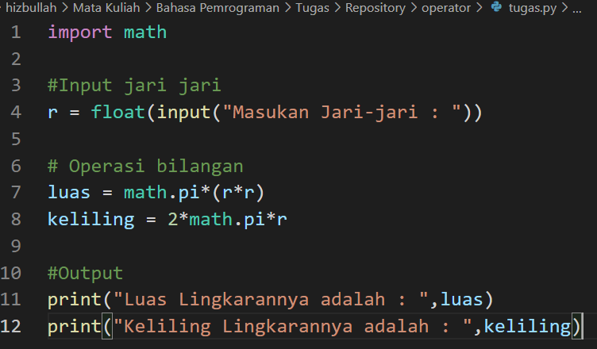   

Pada bagian paling atas, saya menambahkan *import MATH* yaitu modul matematika, Setelah mengimpor modul matematika maka kita dapat mulai menggunakan metode atau konstanta modul. Dalam menghitung luas dan keliling dari sebuah lingkaran, dibutuhkan variable dan operator.    
> r = float( input("Masukan Jari-jari : ") )    

Saya mendeklarasikan *r* (jari-jari) sebagai sebuah variable, nantinya variable ini bisa diisi oleh user dengan angka berapapun karena ada *float input()* nya. Tipe data *float* dipilih karena *float* bisa digunakan untuk bilangan yang mempunyai koma.   

Kemudian setelah itu lakukan pengoperasian bilangan. Kita akan melakukan perkalian bilangan sesuai dengan rumus mencari luas lingkaran dan keliling lingkaran. yaitu **LUAS = π x r2** dan **KELILING = 2 x π x r** . Maka kita tuliskan seperti ini :
> luas = math.pi * ( r * r )     
> keliling = 2 * math.pi * r     

Nantinya *math.PI* akan berganti dengan sendirinya menjadi 3.14 atau 22/7. Untuk perkalian didalam bahasa python ditandai dengan simbol * dan bukan x.    

Setelah itu, kita bisa melihat outputnya menggunakan *print()* jangan lupa panggil kembali variable luas dan variable keliling yang sudah kita buat tadi.    
> print ( "Luas Lingkarannya adalah : ",luas )   
> print ( "Keliling Lingkarannya adalah : ",keliling )     

Saya menginput angka 7 sebagai jari-jari dan hasilnya seperti ini :    

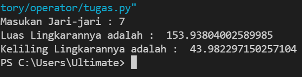    

Jika masih kurang paham, program yang sudah kita buat tadi memiliki flowchart seperti ini :     

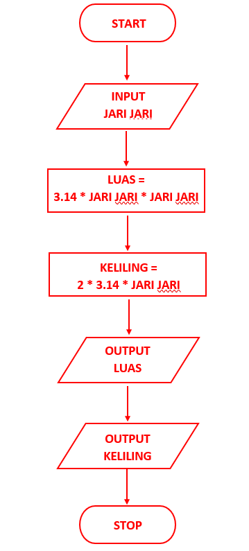

----------------------------------

1. [Penggunaan end](https://github.com/Ridwanwildan/Operator-Python/blob/main/latihan1.py)     
   end berfungsi untuk mengganti karakter terakhir bawaan yang dicetak di layar. Biasanya jika kita ingin memunculkan output *print()* yang lebih dari satu, maka output *print()* yang kedua akan ditampilkan di barisan yang baru. tetapi kalau kita menggunakan end, maka output *print()* yang kedua akan ditampilkan di  barisan yang sama.      
   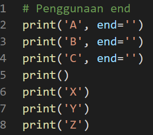    
   maka hasilnya :     
   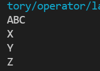      

2. [Penggunaan separator](https://github.com/Ridwanwildan/Operator-Python/blob/main/latihan1.py)      
   Separator digunakan sebagai pemisah antara variable yang satu dengan variable yang lainnya. Separator bisa kita isi dengan apa saja sesuai keinginan kita. Contoh disini kita menggunakan tanda koma, titik dua dan garis strip dan w, x, y, z sebagai variable nya.   
   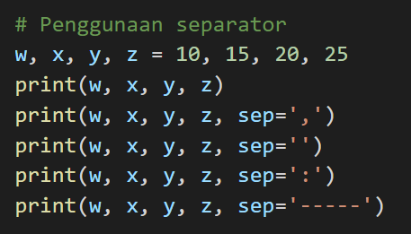     

   Dan hasilnya akan seperti ini :       
   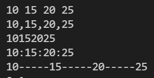       

3. [String format](https://github.com/Ridwanwildan/Operator-Python/blob/main/latihan1.py)       
   Format string default nya ketika dicetak yaitu tulisannya rata kiri. Dan dibawah ini kita menggunakan tanda ** sebagai operasi pemangkatan pada bilangan.      
   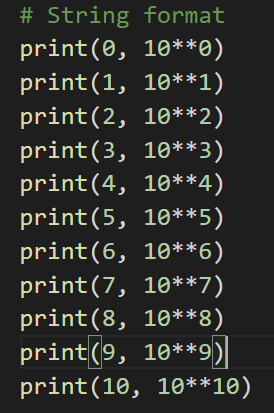    

   Dan hasilnya seperti ini :     
   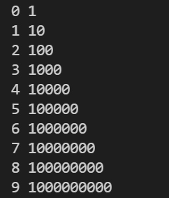     

   Selanjutnya string format yang defaultnya berada di rata kiri, kita bisa mengubahnya menjadi rata kanan dengan menambahkan kode seperti ini :     
   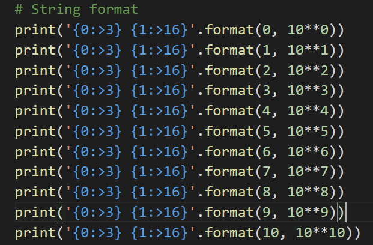     

   Hasilnya akan seperti ini :     
   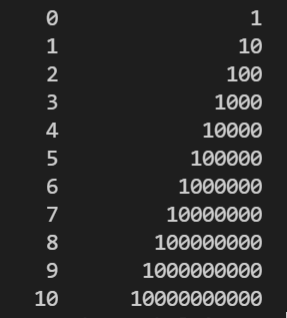     

   > print('{0:>3} {1:>16}'.format(1, 10**1))      
   
   Place holder yang pertama kita isi {0:>3} supaya variable yang pertama terisi space sebanyak 3x spasi.     
   Place holder yang kedua diisi {1:>16} supaya variable kedua terisi space 16x spasi.      
       
----------------------------------

[Konversi nilai variable](https://github.com/Ridwanwildan/Operator-Python/blob/main/latihan2.py)     
Pada baris pertama dan kedua, kita akan mengisi nilai variable a dan variable b kemudian ditampilkan ke output.      
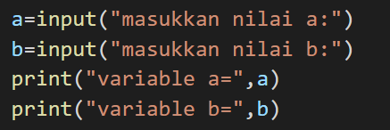      

Jika variable a diisi 5 dan b diisi 4 maka hasilnya seperti ini :       
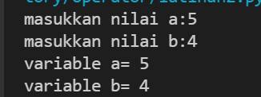      

Kemudian kita lakukan operasi bilangan seperti ini :    
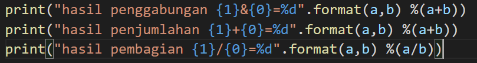      

Maka hasilnya masih error, Karena tipe data yang digunakan masih string dan harus dikonversi ke integer. Konversikan dulu menjadi seperti ini :      
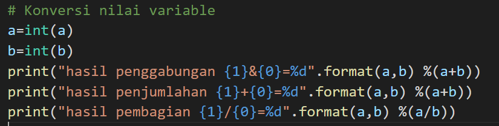      

Jika sudah, kita bisa melihat hasilnya seperti ini :     
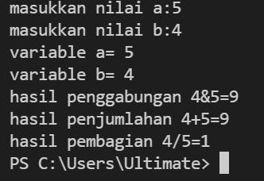      

**Sekian Terimakasih**
